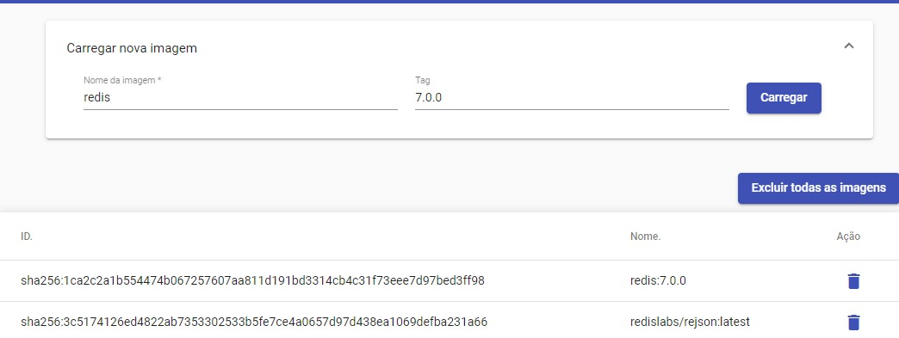
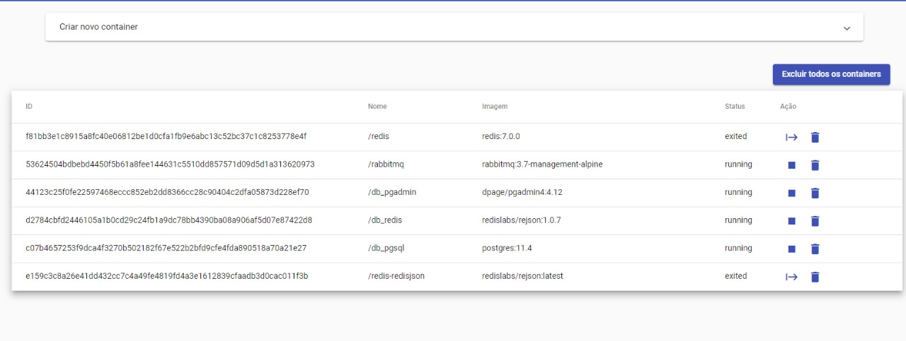
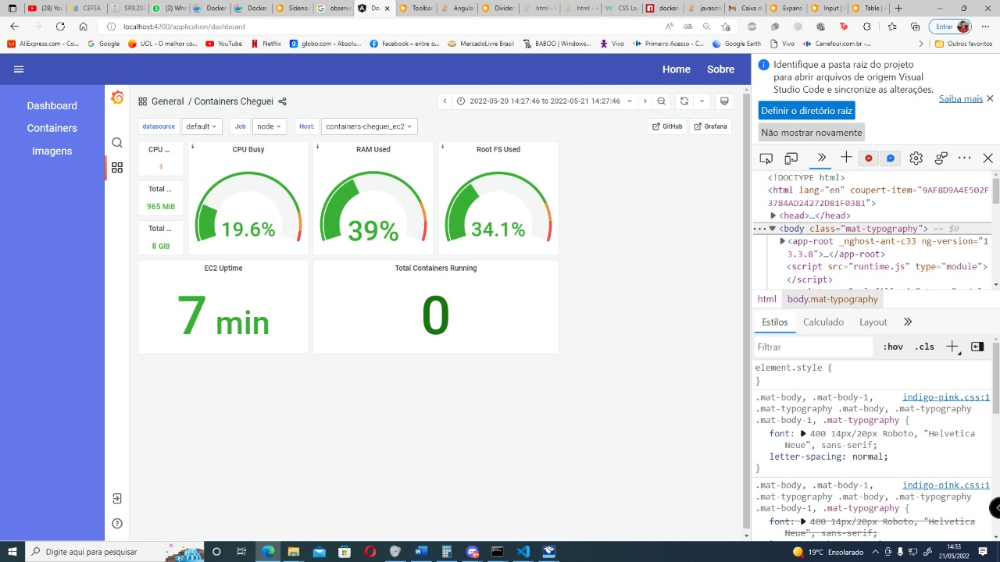
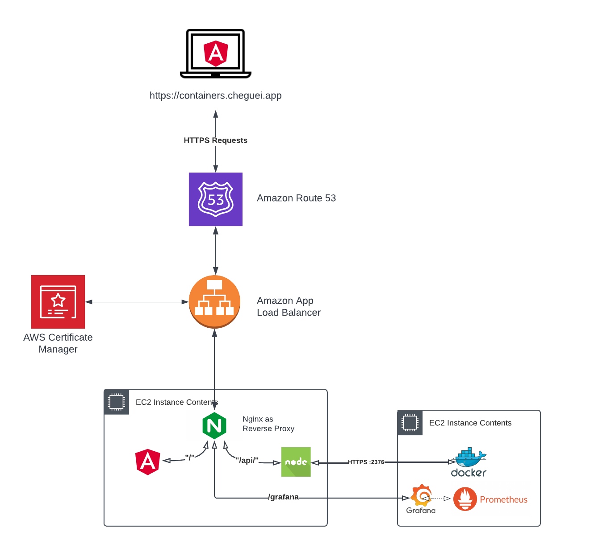
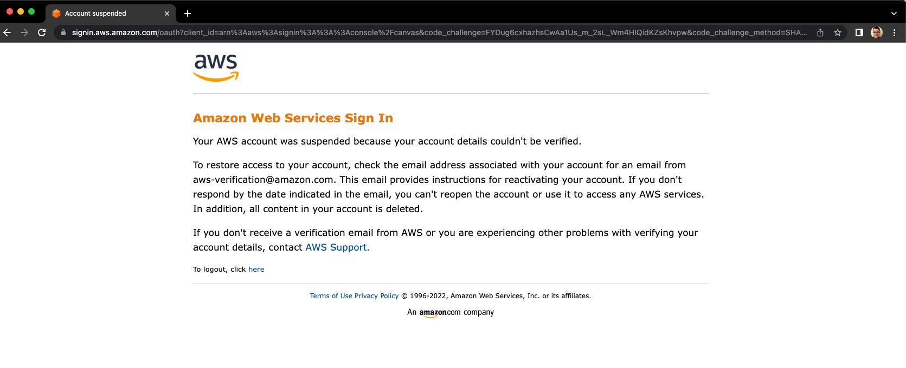

# N2 B2 Serviços De Rede - Docker Services Orchestrator

Componentes do projeto:

- Interface do usuário em `Angular`.
- BFF em `Nodejs` que se comunica com o Docker através de sua API, permitindo a orquestração dos containers.
- Toda infraestrutura está hospedada no provedor de nuvem `AWS`.
- 2 Servidores, sendo que:
  - Um serve o projeto(front+back) para orquestrar os containers.
  - Outro hospeda os containers docker. 
- As métricas da máquina que hospeda os containers são coletadas pelo `Prometheus` e apresentada ao usuário através do `Grafana`.

## Interface :earth_americas:

- **https://containers.cheguei.app/** :warning: desligamos os servidores ⚠️

  

  

  

  

## Infraestrutura em Cloud :scroll:

### Arquitetura

  

### Suspended :fearful:

  

